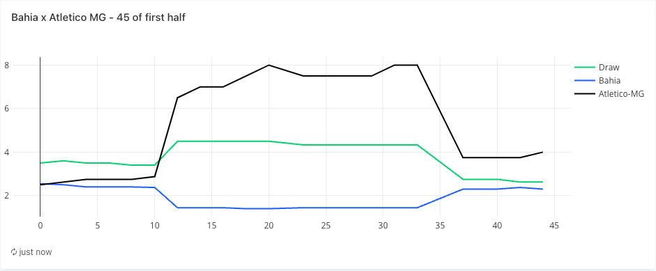
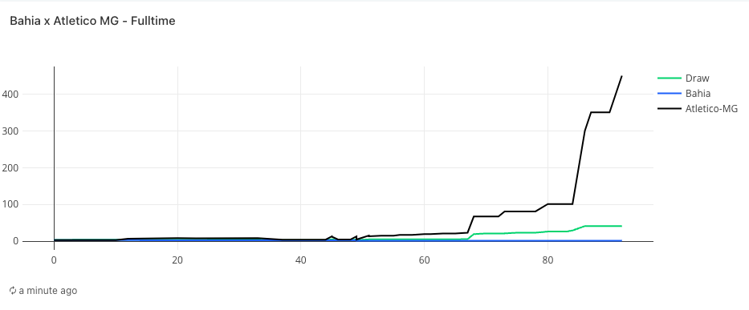
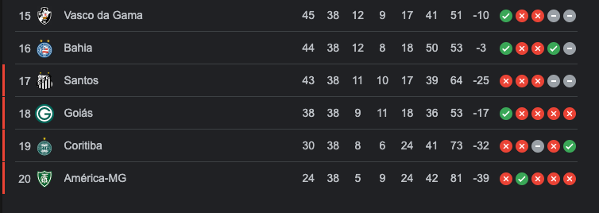

# Exploring the Emotions of Brasileirão: An Innovative Data Journey 
### ELT Football API Data Project

### INTRO
<p>
  I invite you to delve into the heart of the best Championship of the world, the Brazilian Championship, most known as Brasileirão to discover some stories about football.
  This data engineering project is a fascinating odyssey, bringing forth not just statistics but also insights that challenge the way we perceive Brazil's most beloved sport.
  I explored the API to extract precious data from Brasileirão, from 2018 to 2023, unveiling secrets hidden within the numbers.
 </p>
 <p> The choosen data stack was a modern approach, I adopted some of the most advanced tech/data stack: Snowflake, dbt, Kafka, Airflow, Redash, Python, Docker, and AWS. </p>
 <p>  I choosed to do this project because of my love about football, I enjoyed each single moment doing this about my favorite sport. Hope you enjoy it too :) </p>
</p>

### DATA ARCHITECTURE 


### SOLUTION  

The project adopts a Lambda architecture, seamlessly blending batch and streaming layers, with data sourced from the API Football (https://www.api-football.com/).

#### Data Extraction:
The data extraction process is automated using Apache Airflow pipelines. Python scripts within these pipelines adhere to best practices in software development and Object-Oriented Programming (OOP).
The process is facilitated by four scripts designed for the extraction:


#### API Connection
```football_api.py: ```

Contains a class, ```APIFootball```, simplifying the connection to the Football API. The class facilitates various API actions by providing the action name and query string. To use this class, set your Football API key as an environment variable named ```API_KEY```.

#### API Requests
```data_requester.py:```

The ```DataRequester``` class simplifies the retrieval of football events data from the Football API using the ```APIFootball``` class.


#### AWS Connection
```data_uploader.py:```

The ```DataUploader``` class handles the upload of data to an Amazon S3 (Simple Storage Service) bucket.
The script establishes seamless a connection with AWS using boto3 AWS SDK for python. 

#### Core Component
```main.py:```
The core component of the application orchestrates the process. It collects football events data from the Football API using the ```DataRequester``` class and uploads it to S3 using the ```DataUploader``` class.

#### Airflow Setup
The project leverages the Astro CLI for Apache Airflow orchestration, this aproach facilitates the management of Apache Airflow. The following commands initialize, start, and stop the project:
(https://docs.astronomer.io/astro/cli/overview)
```
astro dev init
astro dev start
astro dev stop
```
#### DAGS:
```
dag_process_teams.py
dag_process_teams_statistics.py
dag_process_standings.py
dag_process_odds_in_match.py
dag_process_fixtures.py
dag_process_fixtures_statistics.py
dag_process_fixtures_predictions.py
dag_process_fixtures_odds_pre.py
```
#### LOAD 

 ##### SNOWFLAKE
 <p> Created a free account in Snowflake to exploration, my option was the Enterprise because it have more resources. </p> 

  - <p>You can see the snowflake process steps in the: 
     
     [Snowflake Directory](./snowflake/aws/)</p>
>
  - <b>STEP 1. STORAGE INTEGRATION</b>
    - <p>Created a storage integration between snowflake and S3. It's necessary to create IAM role and policy in AWS to it</p>
  - <b>STEP 2. FILE FORMAT</b>
    - <p>Created a json file format, because the default file format wasn't enough</p>
  - <b>STEP 3. EXTERNAL STAGE</b>
    - <p>Creating an External Stage allows you to easily access and manage data stored in an external storage service, in my case, Amazon S3.</p>
  - <b>STEP 4. DATABASE, SCHEMA, TABLE RAW</b>
    - <p>It is necessary to create the entire context for the raw table that will be used to receive the data from the json</p>
  - <b>STEP 5. SNOWPIPE</b>
    - <p>Snowpipe is a service in Snowflake that enables continuous and automatic data ingestion, simplifying the process by eliminating the need for manual tasks or complex scripts. It ensures that data is loaded automatically into Snowflake as soon as it becomes available in the source location. 

#### TRANSFORM

##### DBT 
  - <p> Created a free account in dbt and linked it to Snowflake. I utilized the dbt cloud and tried to follow best practices according to the dbt manifesto</p>
  - <p>Created three stages: </p>
  - <p> <b> Staging: </b> The goal of staging is to prepare the data for subsequent transformation and loading steps.</p>
  - <p> <b> Curated: </b>  Involves transforming the data into a more refined form, often including cleaning, aggregation, filtering, and other manipulations. In this step, the data is structured and prepared for further analysis or data model creation </p>
  - <p> <b>  Trusted: </b> These are datasets ready for analysis, optimized for efficient querying and visualization. </p>
  - <p> Executed dbt build, and these transformations were returned to Snowflake ready for analysis.</p>
  - <p>You can see the dbt process steps in: 
     
     [Models](./models/)</p>

##### REDASH - DATA VISUALIZATION
- <p> Created a free account in redash, running in an EC2 on AWS and linked it to Snowflake account.</p>
- <p>You can see the config used in the:
[Redash config](https://redash.io/help/open-source/setup#-AWS)
  </p>


##### Chapter 1: Yellow Cards - The Game Beyond the Field:
We deepen our gaze on yellow cards, unraveling the referees who distributed the most warnings and the tactics of teams in tight situations. An analysis that goes beyond statistics, delving into the psychology of the game.


##### Chapter 2: Odds Variation - The Pulse of the Game:
We follow the dance of odds during real-time games. A data stream that reflects the emotion of the matches, revealing unexpected turnarounds and last-minute strategies.

#### The battle against relegation in the 2023 season

In 18 scenarios: 

- Bahia had 72% of chances of relegation
- Santos had 16% of chances of relegation
- Vasco had 11% of chances of relegation

However, in all three of the games below, all three of the teams were on the 17th spot in the table at least once during the 3 games. Either way, you can see that fight in the dance of odds. First, have a look at the scenarios: 

LEGEND:
- Ganha = Win
- Perde = Lose
- Empata = Draw


##### Santos x Fortaleza - 38th ROUND


##### Vasco x Bragantino - 38th ROUND


##### Bahia x Atletico MG - 38th ROUND






#### The End: 



<b>  PS: Santos was relegated to Brasileirao Serie B 2024 </b> 

##### Chapter 3: Home and Away Performance Internacional:
We discover the secrets of teams as hosts and visitors, revealing patterns that go beyond wins and losses. The stadium atmosphere, the pressure of the crowd—everything translates into numbers.


##### Chapter 4: Home and Away Performance Palmeiras 2018,2022 and 2023 Championship Winner:
<p> It's possible to analyse that Palmeiras who won the championship </p>

 1. 2018 Season:
   - From 38 rounds, had 16 wins at home and 7 wins away as a visitor, with a total of 23 wins.
   - Experienced 3 losses away as a visitor and 1 at home, resulting in a total of 4 losses.

1.1 2018 Season Summary:
   - Total Wins: 23
   - Total Losses: 4

2. 2022 Season:
   - From 38 rounds, had 13 wins at home and 10 wins away as a visitor, with a total of 23 wins.
   - Faced 2 losses away as a visitor and 1 at home, resulting in a total of 3 losses.

2.1 2022 Season Summary:
   - Total Wins: 23
   - Total Losses: 3

3. 2023 Season:
   - From 38 rounds, had 14 wins at home and 6 wins away as a visitor, with a total of 20 wins.
   - Encountered 5 losses away as a visitor and 3 at home, resulting in a total of 8 losses.

3.1 2023 Season Summary:
   - Total Wins: 20
   - Total Losses: 8


    

##### Chapter 5: Home and Away Performance Flamengo 2019,2020 Championship Winner:

<p> It's possible to analyse that Flamengo who won the championship </p>

1. <b> 2019 Season: </b>
   - From 38 rounds, had 13 wins at home and 8 wins away as a visitor, with a total of 21 wins.
   - Faced 4 losses away as a visitor and 0 at home, resulting in a total of 4 losses.

  1.1 2019 Season Summary:
     - Total Wins: 21
     - Total Losses: 4

2. <b> 2020 Season: </b>
   - From 38 rounds, had 9 wins at home and 6 wins away as a visitor, with a total of 14 wins.
   - Encountered 5 losses away as a visitor and 4 at home, resulting in a total of 9 losses.

  2.1 2020 Season Summary:
     - Total Wins: 14
     - Total Losses: 9


We can understand with these results that you must have something more than 20 wins and less than 5 loses during the championship to have a calm season with the trophy in the final,
but we also can see that with worst results than that in 2020 with Flamengo and their 14 wins and 9 loses and in 2023 with Palmeiras and their 20 wins and 8 loses that counted with a little bit lucky on the final lap of the championship as you can see here: 


Leader per Round 2020 - Flamengo 2 rounds


Leader per Round 2023 - Palmeiras 4 rounds


### TECH STACK 


